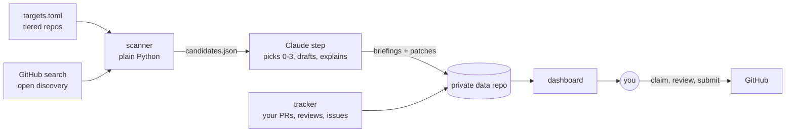

# oss-scout

A nightly scout for open source contributions that keeps a human in charge.

It finds issues worth working on, measures how each project treats outside
contributors, prepares a draft fix with a thorough explanation, and puts it all
on a private dashboard. It never comments, opens a pull request, or posts
anything. The person reads the briefing, understands the change, and does the
contributing themselves.

## Why

Maintainers are drowning in low-effort, machine-generated pull requests. The
answer isn't to generate more of them faster. It's to do the tedious parts
(searching, triage, reading unfamiliar code) automatically and leave the parts
that build trust with a real person: claiming an issue, defending a change in
review, and following through.

## How it works



1. **Scan** (`python -m scout run`, no LLM involved). Collects open, unassigned
   issues labelled as beginner-friendly, help-wanted, bounty or confirmed-bug from a
   tiered list of projects, plus open search across GitHub at a lower weight.
2. **Measure each project** from its own recent history. From the last 300 closed
   PRs by occasional outside contributors (PRs from forks, by people with fewer
   than three recent PRs; staff push branches to the repo itself): merge rate, median days to merge, and median time until a
   maintainer first replies. Also reads CONTRIBUTING / AI-policy files for AI rules
   and CLA requirements. This becomes a 0–100 *friendliness* score.
3. **Filter** anything already claimed: linked open PRs, recent "I'll take this"
   comments, assignees, blocking labels.
4. **Skip** issues already suggested, and for 60 days any the Claude step turned down
   (claimed elsewhere, needs special hardware, needs a design decision).
5. **Rank** by friendliness, freshness, label fit, language fit, project tier and
   your own history with the project.
6. **Brief.** A scheduled Claude Code routine reads the top candidates, picks zero
   to three, reproduces and drafts a fix where it can, and writes a briefing: the
   issue in plain English, how that part of the codebase works, the change explained
   piece by piece, rejected alternatives, likely reviewer questions with answers,
   what was and wasn't tested, and the project's AI-disclosure expectations.
7. **Track** what you actually did, straight from GitHub. Suggestions move through
   `suggested → claimed → pr_open → waiting_on_you → merged`. Nothing is
   self-reported.

## Where it runs

Two scheduled jobs, neither of which needs a laptop:

- **GitHub Actions** (`.github/workflows/nightly.yml`, scheduled for 9:17pm Pacific,
  though GitHub often starts it hours late) runs the scanner and tracker, saves the
  results to a private data repo, and publishes the public page at
  **[scout.aadityad.dev](https://scout.aadityad.dev)**.
- **A Claude Code routine** is started by the workflow (through the routine's API
  trigger) as soon as the scan is saved, so it always reads a fresh scan. A 7:37am
  Pacific run is the fallback and stops if the night's work is already done. It reads those results, picks what's worth doing, prepares
  briefings, and refreshes a private dashboard. It never calls
  the GitHub API, which cloud sessions can't reach beyond their own repo; cloning
  public repos is enough.

The public page shows only finished, public facts: contributions to other projects,
the per-project research, and briefings for work that's already merged or closed.
Briefings for projects that don't accept AI-assisted work are never published.

## Guardrails

The routine runs unattended with the owner's GitHub identity and reads text written
by strangers, so it is boxed in:

- `guard/guard.py` is a Claude Code `PreToolUse` hook that blocks every GitHub
  write: `gh pr/issue create|comment|review|merge…`, `gh api` with a write method or
  a body, `curl` writes to GitHub, remote rewrites, and every `git push` except one
  branch of the private data repo. GitHub tools are allowed only when they start with
  a read verb. 37 tests in `tests/test_guard.py`.
- Cloud sessions only honor a repo's hooks when the session has a single
  repository, so the routine opens only the private data repo (where
  `scout init-data` installs the hook) and clones this public repo read-only.
- The prompt treats issue text as data, never as instructions.

## Usage

```bash
python3 -m scout doctor        # check GitHub access
python3 -m scout run           # scan -> data/candidates.json
python3 -m scout track         # refresh contribution history only
python3 -m scout ingest        # record new briefings as suggestions
python3 -m scout digest        # write data/digest.json: what needs you today
python3 -m scout render        # build data/dashboard.html
python3 -m scout init-data     # install guard + settings into the data dir
```

To act on a suggestion, run `/contribute` in a Claude Code session in this repo. It
loads the briefing, reuses one local clone per project, and prepares the commit and
PR for you to approve and send under your own name.

`SCOUT_DATA_DIR` points at the data directory (defaults to `./data`). Standard
library only, Python 3.11+. It uses `gh api` when the GitHub CLI is available and
falls back to `GH_TOKEN`. REST only, because the cloud GitHub proxy blocks most
GraphQL.

Tests: `python3 -m pytest`.

## Configuration

Everything lives in [`targets.toml`](targets.toml): your login and languages,
project tiers and weights, label patterns, discovery settings, and the date until
which the scout explores widely before recommending two or three home projects
based on what actually got merged.

## License

MIT
