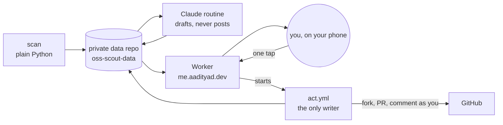

# oss-scout

A nightly scout for open source contributions that keeps a human in charge.

Every night it finds issues worth working on, measures how each project treats
outside contributors, and prepares one contribution completely: a tested draft
fix, the pull request text, and a plain-English explanation. In the morning you
look at it on your phone, edit it if you want, and tap once. **Nothing is ever
posted without that tap.**

## Why

Maintainers are drowning in low-effort, machine-generated pull requests. The
answer isn't to generate more of them faster. It's to do the tedious parts
(searching, triage, reading unfamiliar code) automatically and leave the parts
that build trust with a real person: deciding what is worth sending, reading
the change before it goes out, defending it in review, and following through.
The tap is the point: a person looked at this and stands behind it.

## What runs when

| When (Pacific) | What | Where |
| --- | --- | --- |
| about 9pm | **Scan**: finds and ranks issues, refreshes your PR and review history. No AI. | GitHub Actions in this repo (`nightly.yml`; GitHub often starts it hours late) |
| right after the scan | **Routine**: a Claude cloud routine prepares at most one *ready* item plus up to two briefings, and drafts replies to reviews waiting on you. | Claude routines, started by the scan |
| 8am | **Email**: what's ready, what's waiting on you, what's new. Sent only when there is something to say. | Cloudflare Worker cron |
| whenever you tap | **Act**: does the GitHub write you approved, as you. | `act.yml` in the data repo, started by the Worker |



## Your day, about 10 minutes

1. **Open [me.aadityad.dev](https://me.aadityad.dev)** (or tap the link in the 8am email). Sign in with Cloudflare Access if asked.
2. **Waiting on you** comes first. A maintainer is waiting on a PR of yours; red means more than 48 hours.
   - *Small* follow-up (a rename, a test, formatting): read the fix and the drafted reply, edit if you like, tap **Push fix & reply**.
   - *Discuss* follow-up (they question the approach): read the talking points and take it to `/contribute` on your laptop.
3. **Ready for you**: read the summary, risks and diff, edit the title and description, then tap **Submit PR** (or **Post comment** for repro, triage and review items). You get one confirmation. The PR description keeps any AI-disclosure sentence the project requires; the page won't let you remove it.
   - **Later** snoozes it for three days. **Skip** turns it down for good.
4. The page shows the run's progress. When it says Done, tap **Reload**.
5. Everything else (earlier suggestions, history, project stats) is under the tabs and optional.

A quiet morning is normal: zero ready items is a fine night.

## When to use `/contribute` on the laptop

Run `/contribute` in a Claude Code session in this repo for the things that shouldn't be one tap:

- **Guide-mode projects** (DuckDB and others that ban AI-written code). The scout writes no code there. It explains the problem and you write the fix.
- **Discuss follow-ups**: a reviewer asks *why*, and you want to think it through.
- Any suggestion you want to pair on instead of sending as prepared.
- Projects that allow AI-assisted code but not AI-written posts (llama.cpp): the claim comment is bullet points for you to write yourself.

It loads the briefing, reuses one local clone per project, and prepares the commit and PR for you to approve and send under your own name.

## Where things live

- **This repo (public)**: the scanner and tools (`scout/`), the Claude guard hook (`guard/`), the routine's instructions (`routine/PROMPT.md`), the dashboard template (`dashboard/`), the Worker (`worker/`), and `targets.toml`, where every setting lives.
- **`aadityad12/oss-scout-data` (private)**: `main` holds the routine's `.claude/` config and `act.yml`. Branch `claude/scout-data` holds `state.json`, `briefings/<owner>__<repo>__<n>/` (briefing, `draft.patch`, `pr.json`, `post.md`, `followups/`), `picks/`, `digest.json` and `dashboard.html`.
- **me.aadityad.dev (private)**: a Cloudflare Worker behind Cloudflare Access. It serves `dashboard.html` and turns a tap into an `act.yml` run.
- **[oss.aadityad.dev](https://oss.aadityad.dev) (public)**: your contributions only: merged and open PRs, projects, activity. No briefings, no research.

## One-time setup checklist

- [ ] **Secrets in `oss-scout`** (public repo): `DATA_REPO_TOKEN`, `ROUTINE_FIRE_URL`, `ROUTINE_TOKEN` (already set).
- [ ] **`SUBMIT_TOKEN` in `oss-scout-data`** (Settings, Secrets and variables, Actions): a *classic* personal access token with only the `public_repo` scope, created on your account. It's the only place this token lives. The routine never sees it.
- [ ] **Rotate it every 90 days**: make a new token, replace the secret, then set `[submit] token_rotated` in `targets.toml` to today. The email and dashboard warn after 80 days.
- [ ] **Install the workflow**: in a checkout of the data repo's **default branch, `main`**, run `SCOUT_DATA_DIR=<that checkout> python3 -m scout init-data`, then commit and push `.github/workflows/act.yml` along with the `.claude/` files (`workflow_dispatch` only finds workflows on the default branch). Re-run it after changing `scout/datarepo.py`.
- [ ] **Worker**: follow [`worker/README.md`](worker/README.md) (Cloudflare Access app, a fine-grained token limited to `oss-scout-data`, `npx wrangler deploy`, two secrets, Resend).
- [ ] **DNS**: `oss.aadityad.dev` CNAME to `aadityad12.github.io` (the public page), and a redirect rule `scout.aadityad.dev` to `oss.aadityad.dev`. `me.aadityad.dev` is created by the Worker deploy.
- [ ] **Routine model**: in the routine's settings on claude.ai, set the model to **Sonnet**.

## Guardrails

The routine runs unattended and reads text written by strangers, so it is boxed in.

- **The routine can't write to GitHub.** `guard/guard.py` is a Claude Code `PreToolUse` hook that blocks every GitHub write (`gh pr/issue create|comment|review|merge`, `gh api` with a write method or body, `curl` writes, remote rewrites) and every `git push` except one branch of the private data repo. It is unchanged. 37 tests in `tests/test_guard.py`. Cloud sessions honor a repo's hooks only when the session has a single repository, so the routine opens only the data repo and clones this one read-only.
- **The only writer is `act.yml`**, and only your tap starts it: Cloudflare Access (your email only) guards the dashboard, the Worker checks the Access token again, rejects cross-site requests and accepts only a fixed list of actions. Its token, `SUBMIT_TOKEN`, exists only in the data repo's secrets.
- **Every action is re-checked before anything is written** (`scout/act.py`): the item exists and has the right status, the briefing still validates, guide-mode and "no AI-written posts" projects are refused, the repo and branch names are sane, your open-PR limits still hold, and edited text has no AI markers and still has the required disclosure sentence. `--dry-run` shows what would happen.
- **No AI markers anywhere you post**: no `Co-Authored-By`, "Generated with", robot emoji or tool names in commits, PR text, comments or branch names. Commits use your name and your GitHub noreply address, with no trailers except `Signed-off-by` when a project requires DCO.
- **Disclosure is explicit.** When a project requires it, exactly one plain sentence in your voice goes in the PR body; it is never ticked or filled any other way.
- **Stranger text is data.** The prompt treats issue text as data, and the dashboard escapes or sanitizes everything it shows.

## Models

The routine runs on **Sonnet** and does the triage, drafting and briefings itself.

- **Opus** only through the `root-cause-analyst` subagent, at most once per pick, for hard picks, fixes that fail their tests, or deep root-causing in big C++ codebases.
- **Haiku** through the `thread-summarizer` subagent, for long issue threads.
- The scanner and everything in `act` use no model at all.

## How the scan works

1. **Scan** (`python -m scout run`, no LLM). Collects open, unassigned issues labelled beginner-friendly, help-wanted, bounty or confirmed-bug from a tiered list of projects, plus open search across GitHub at a lower weight.
2. **Measure each project** from its recent history: of the last 300 closed PRs by occasional outside contributors (from forks, by people with fewer than three recent PRs), the merge rate, median days to merge and median time to a maintainer's first reply. It also reads CONTRIBUTING and AI-policy files for AI rules and CLA requirements. This becomes a 0-100 *friendliness* score.
3. **Filter** anything already claimed (linked open PRs, recent "I'll take this" comments, assignees, blocking labels).
4. **Skip** issues already suggested, and for 60 days any the routine or you turned down.
5. **Rank** by friendliness, freshness, label fit, language fit, project tier and your history with the project.
6. **Prepare.** The routine picks, reproduces and drafts where it can, and writes the briefing and, for the ready item, the files `act` uses. Work in flight is limited (`max_open_prs`, `max_open_prs_per_repo`, one ready item at a time).
7. **Track** what you actually did, read from GitHub, never self-reported: `suggested → claimed → pr_open → waiting_on_you → merged`; prepared items go `ready → approved → submitting → pr_open` (or `posted`).

## Commands

```bash
python3 -m scout doctor        # check GitHub access
python3 -m scout run           # scan -> data/candidates.json
python3 -m scout track         # refresh contribution history only
python3 -m scout ingest        # record new briefings as suggestions
python3 -m scout digest        # write data/digest.json
python3 -m scout render        # build data/dashboard.html
python3 -m scout render-public # build the public page
python3 -m scout init-data     # install guard, settings and act.yml into the data dir
python3 -m scout act --key owner/repo#123 --action submit --dry-run   # what a tap would do
```

`SCOUT_DATA_DIR` points at the data directory (default `./data`). Standard library only, Python 3.11+. Reads use `gh api` when the GitHub CLI is available and fall back to `GH_TOKEN`; REST only, because the cloud GitHub proxy blocks most GraphQL. Writes live only in `scout/ghwrite.py`.

Tests: `python3 -m pytest` and `cd worker && node --test`.

## Configuration

Everything lives in [`targets.toml`](targets.toml): your login and name, languages, project tiers and weights, label patterns, discovery settings, work-in-progress limits, the token rotation date, and the date until which the scout explores widely before recommending two or three home projects.

## License

MIT
